# Задание 1. Анализ безопасности системы

# Решение

## Текущее состояние

#### Диаграмма 1: Потоки данных процесса регистрации пациента

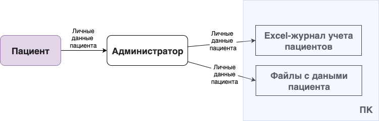

#### Диаграмма 2: Потоки данных процесса записи пациента

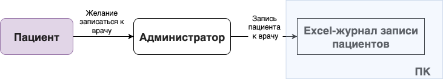

#### Диаграмма 3: Потоки данных процесса приема пациента у врача

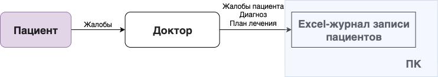

#### Диаграмма 4: Потоки данных процесса сдачи анализов пациентом

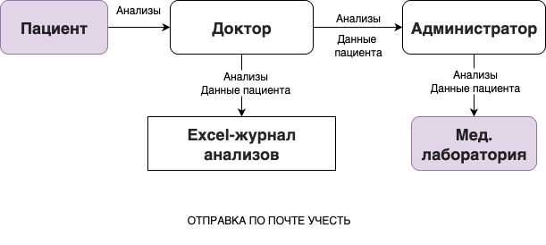

#### Диаграмма 5: Потоки данных процесса получения анализов пациентом

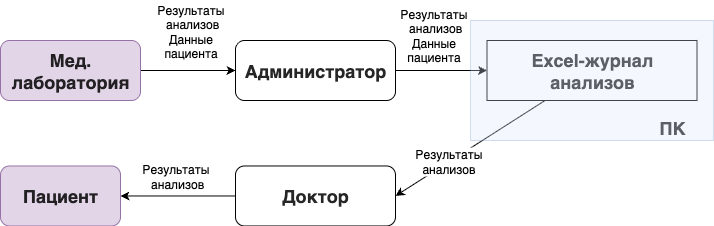

#### Диаграмма 6: Потоки данных процесса оплаты анализа пациента

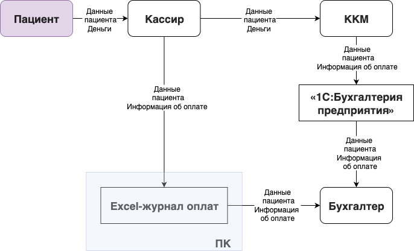

#### Диаграмма 7: Потоки данных обновления расходников на складе

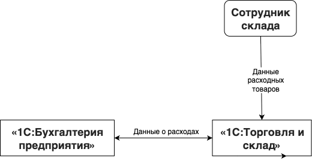

## Аудит мер по обеспечению безопасности данных

### Список проблемных зон:

1. Конфиденциальные данные об учете пациентов, информации о пациентах, записи о пациентах хранятся в Excel на
   компьютере: эти данные может заполучить любой, у кого есть доступ к компьютеру компании, данные не зашифрованы и
   могут утечь целиком в первоначальном виде, что понесет за собой серьезные штрафы и репутационные риски для компании
2. Результаты анализов передаются между лабораторией и компанией в Excel-файле, снова в незащищенном виде, они могут
   быть повреждены при передаче или могут утечь целиком после сохранения
3. Необходимо предусмотреть, чтобы в 1с при получении данных об оплате пациента, бухгалтер не видел конфиденциальные
   данные пациента - достаточно видеть только часть этих данных, по которым невозможно восстановить целиком данные
   пациента, так как для бухгалтера это ненужная информация

## Улучшенные с точки зрения конфиденциальности данных потоки данных

### Cписок данных для защиты

1. Личные данные пациента - шифрование
2. Данные диагноза пациента и назначенного лечения - шифрование (для использования) / обезличивание (для аналитики)
3. Анализы пациента - обезличивание
4. Результаты анализа пациента - обезличивание
5. Запись пациента на прием к врачу - шифрование
6. Данные о реквизитах оплаты пациента - шифрование
7. Данные о реквизитах оплаты покупок расходных материалов - шифрование

### Механизм тегирования данных

1. Личные данные пациента: Имя, адрес пациента, аллергии, хронические заболевания и т д - тег: PII
2. Диагноз и назначенное лечение - тег: PHI
3. Анализы пациента - тег: Анализы пациента
4. Запись пациента на прием к врачу - тег: Запись пациента
5. Реквизиты оплаты пациента - тег: Реквизиты пациента
6. Реквизиты оплаты расходных материалов - тег: Реквизиты расходников

### Список инструментов, способов и мер, которые позволят обеспечить конфиденциальность данных в  потоках

1. Все конфиденциальные данные в хранилище (1С, Excel и др) должны быть зашифрованы
2. При передаче конфиденциальных данных между кем-либо, данные должны быть либо зашифрован, либо обезличены
3. Все данные реквизитов оплаты и личные данные пациентов должны быть зашифрованы

### Обновленные диаграммы потоков

#### Диаграмма 8: Потоки данных процесса регистрации пациента

Необходимо добавить шифрование конфиденциальных данных пациента, чтобы в случае утечки не понести риски

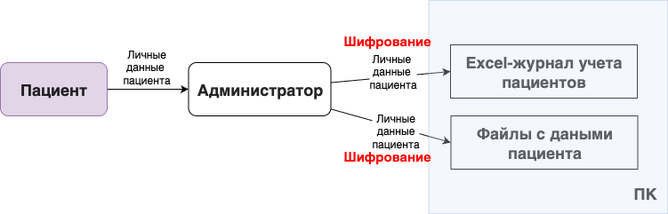

#### Диаграмма 9: Потоки данных процесса записи пациента

Необходимо добавить шифрование конфиденциальных данных пациента, чтобы в случае утечки не понести риски

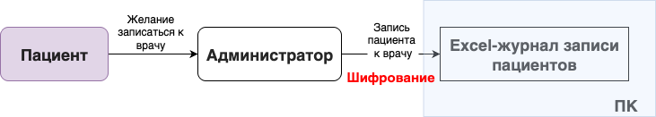

#### Диаграмма 10: Потоки данных процесса приема пациента у врача

Необходимо добавить шифрование конфиденциальных данных пациента, чтобы в случае утечки не понести риски

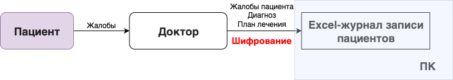

#### Диаграмма 11: Потоки данных процесса сдачи анализов пациентом

Необходимо добавить шифрование конфиденциальных данных пациента, чтобы в случае утечки не понести риски. Также
необходимо шифровать анализы и результаты, передавая их в стороннюю лабораторию, чтобы лаборатория не знала того, чьи
анализы она расшифровывает, также чтобы избежать потерь конфиденциальных данных при передаче. Также в идеале, чтобы
администратор не обладал данными пациента целиком, а только их частью, для этого к данным можно применить обфускацию,
например, занулением части данных.

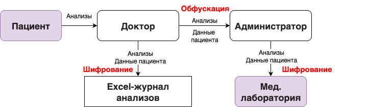

#### Диаграмма 12: Потоки данных процесса получения анализов пациентом

Конфиденциальные данные, занесенные в Excel, должны быть зашифрованы.

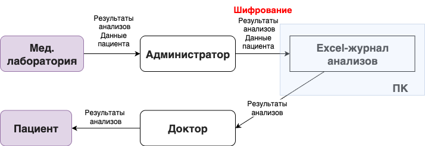

#### Диаграмма 13: Потоки данных процесса оплаты анализа пациента

Конфиденциальные данные карты паицента должны быть зашифрованы при сохранении в хранилище. Бухгалтер не должен получать
конфиденциальные данные целиком, здесь больше всего подойдет механизм обфускации, например, зануление части данных.

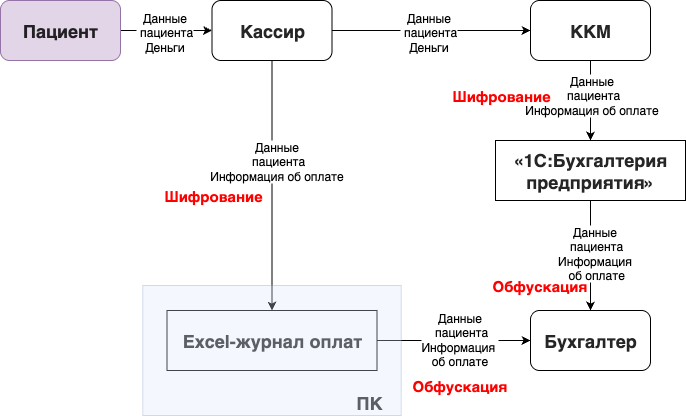

#### Диаграмма 14: Потоки данных обновления расходников на складе

Данные о картах должны быть зашифрованы при передаче.

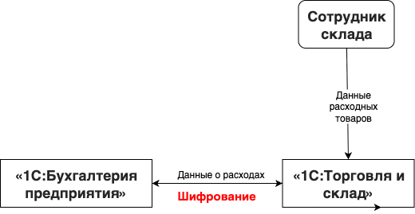
