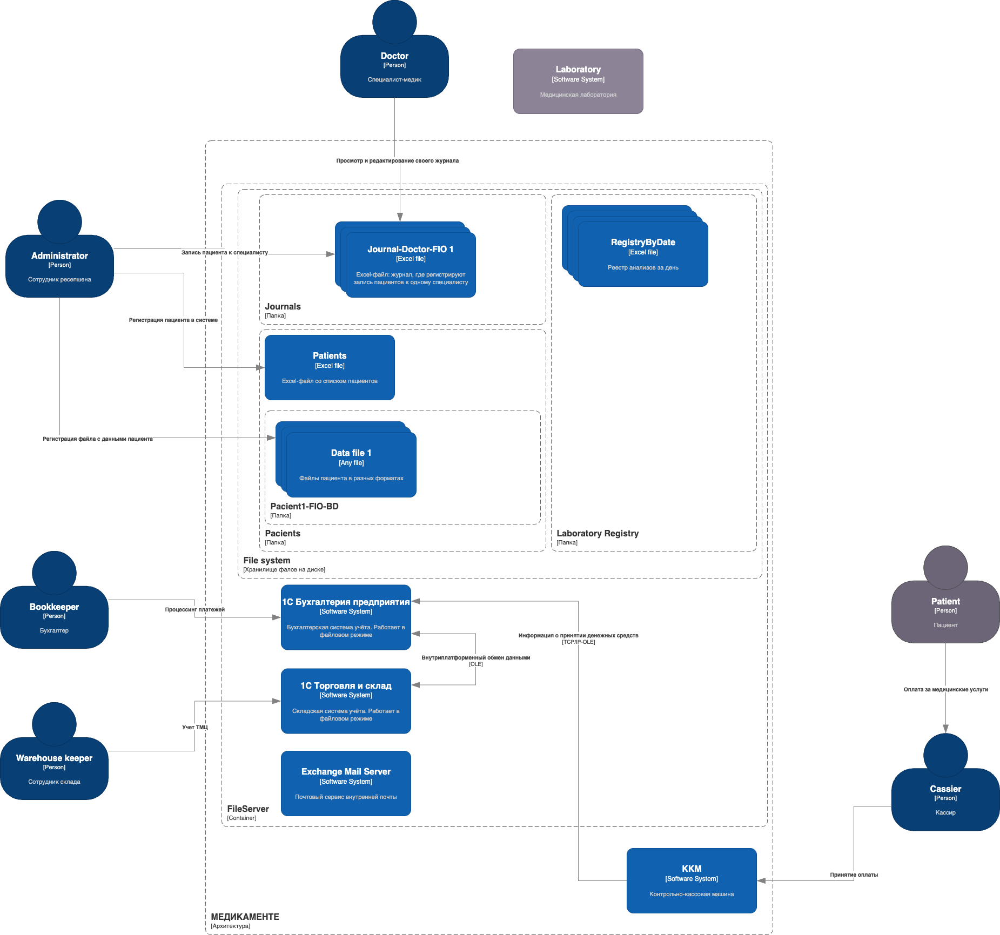
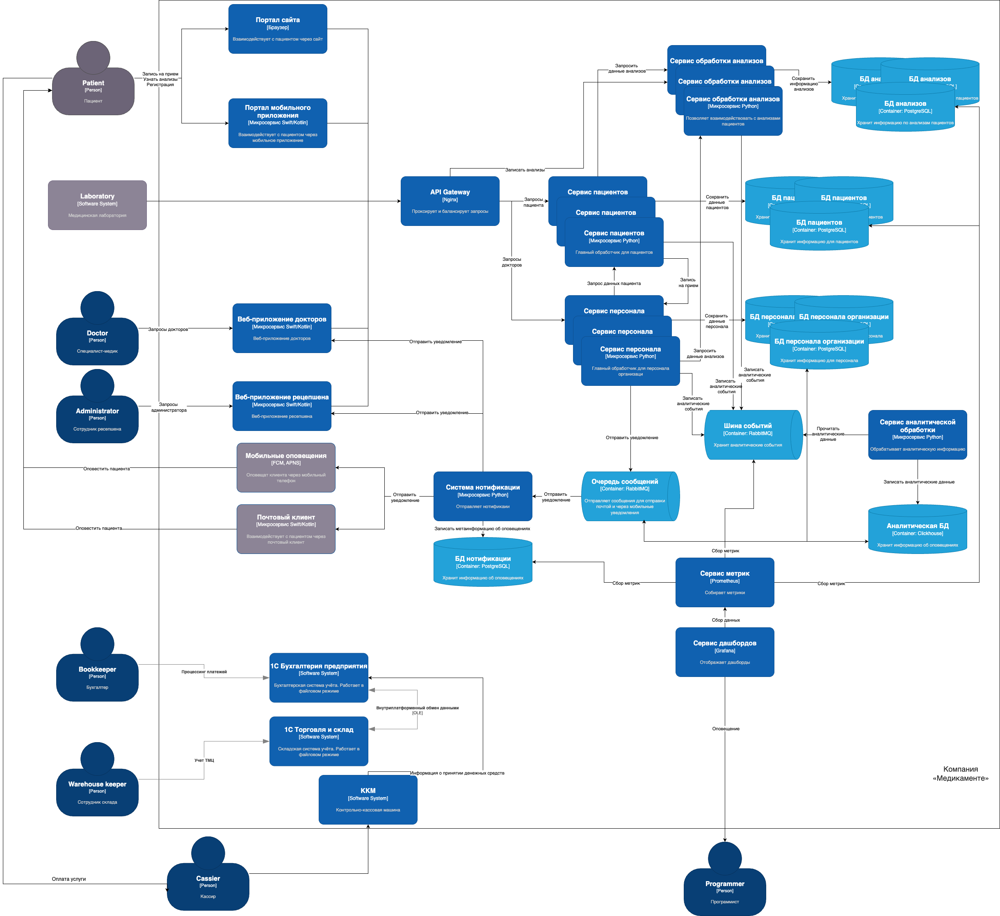

# Задание 2. Проектирование решения

Ваша задача — спроектировать механизмы управления такими рисками до момента реализации изменений в проектируемой
системе.
В рамках этого задания вам нужно проанализировать состояние As-Is и оценить, как спроектировать решение с учётом
требований To-Be.

#### Диаграмма С4 текущего состояния системы AS IS

# Решение

### Перечень принятых решений

1) CSV-файлы удалены из системы - они заменены на полноценные микросервисы с БД
2) Предполагается, что чувствительные данные будут храниться во всех БД в зашифрованном виде
3) Установлен API-Gateway для проксирования и балансировки нагрузки
4) Все микросервисы оснащены RBAC/RBAC + ABAC, позволяя доступ только к тем данным, к которым есть доступ
5) У персонала (администраторы, врачи) есть свой визуал - веб-приложение, посредством которых они могут получать всю
   необходимую для себя информацию
6) Взаимодействие между персоналом также происходит через веб-приложения и систему бэкенда
7) Создан микросервис для сбора и доступа к анализам, с которым будет взаимодействовать лаборатория, пациенты и врачи
8) Система удовлетворяет состоянию TO BE и нефункциональным требованиям
9) В системе предусмотрен сбор метрик через Prometheus, Grafana с оповещением программистов
10) В системе предусмотрен сбор аналитической информации с хранением в Clickhouse
11) Предполагается, что категории данных размечены тегами, возможность доступ к данным решается на уровне микросервиса
    через теги и ролевую модель с
    фиксацией получений доступов в БД сервиса, к этим БД имеет доступ Prometheus, который помогает Grafana отображать
    графики, в случае несанкционированного доступа разработчики будут оповещены

#### Диаграмма контейнеров С4 будущего состояния системы TO BE

* В рамках решаемой задачи было принято решение детализовать диаграмму C4 до диаграммы контейнеров, чтобы более детально
  и точно решить задачу

