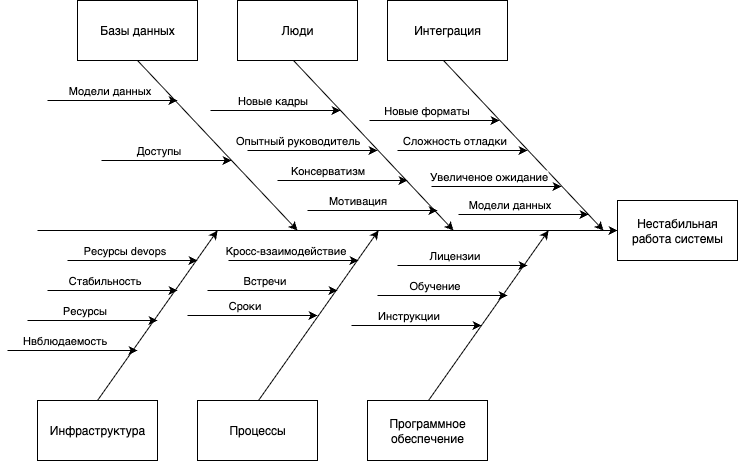

# Задание 4. Оценка узких мест при миграции

# Решение

## Диаграмма Исикавы

## Выявленные проблемы

### Категории и ключевые риски:

| Категория          | Проблемы                                                                                                                                     | Риски для системы                           |  
|--------------------|----------------------------------------------------------------------------------------------------------------------------------------------|---------------------------------------------|  
| **Люди**           | Новые кадры, недостаток мотивации, консерватизм, необходимость опытного руководителя                                                         | Низкая адаптация, сопротивление изменениям  |  
| **Базы данных**    | Сложные модели данных, ограниченные доступы                                                                                                  | Задержки обработки, уязвимости безопасности |  
| **Инфраструктура** | Нехватка ресурсов DevOps, нестабильность окружения, повышение сложности отладки и наблюдаемость ошибок системы, повышенные ресурсы на деплой | Сбои, низкая отказоустойчивость             |  
| **Процессы**       | Недостаточные встречи, несоблюдение сроков, кросс-взаимодействие команд                                                                      | Потери времени, срывы релизов               |  
| **ПО**             | Проблемы с лицензиями, недостаток обучения, время на написание инструкций                                                                    | Юридические риски, низкая квалификация      |  
| **Интеграция**     | Сложность отладки, несовместимость форматов, увеличение ожидания ответа из-за распла монолита                                                | Задержки интеграции, ошибки данных          |  

## Предложенные решения

- Стандартизация API и форматов данных (JSON Schema, Swagger)
- Написание общей документации, схем БД в едином месте (Confluence)
- Создание нескольких стендов (dev, test, stage, prod)
- Регулярное интеграционное тестирование
- Внедрение Agile-практик и кросс-командных встреч
- Ведение метрик по задачам для отслеживания сроков
- Своевременное получение лицензий и одобрение СБ
- Своевременное обучение сотрудников и/или набор новых с имеющимися необходимыми компетенциями
- Внедрение мониторинга (Prometheus/Grafana) для отслеживания стабильности
- Автоматизация развертывания (CI/CD)
- Добавление трассировки запросов (Jaeger)
- Подключение сбора логов (ELK)

